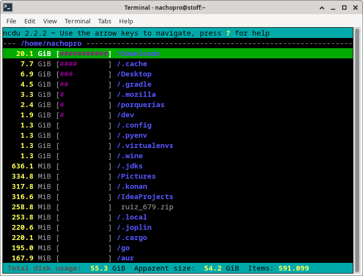

# ncdu: mi analizador de uso de disco favorito
9 de Febrero de 2023

## Introducción
Siempre llega un momento en el que nuestro disco se llena y no sabemos por qué. Empezamos a revisar la carpeta de descargas o ver si tenemos muchos virtualenvs añejos y cosas por el estilo.

Bueno, eso es historia (?) ya que con ncdu podemos ver en nuestra PC o Servidor remoto dónde se está gastando mucho espacio para actuar en consecuencia.

## Instalación y uso
Con usar el gestor de paquetes de tu distro e instalar ncdu estamos hechos.
Sólo necesitamos ejecutarlo (ncdu) desde el directorio de nuestro interés y navegar al estilo Norton Commander en busca del espacio perdido, es bastante intuitivo.

### Atajos de teclado
Hay varios, para ordenar por nombre, tamaño, cantidad de archivos o mime type pero los importantes son

* ?: Ayuda
* d: Borramos el archivo/directorio seleccionado

### Referencia
[https://dev.yorhel.nl/ncdu](https://dev.yorhel.nl/ncdu)
